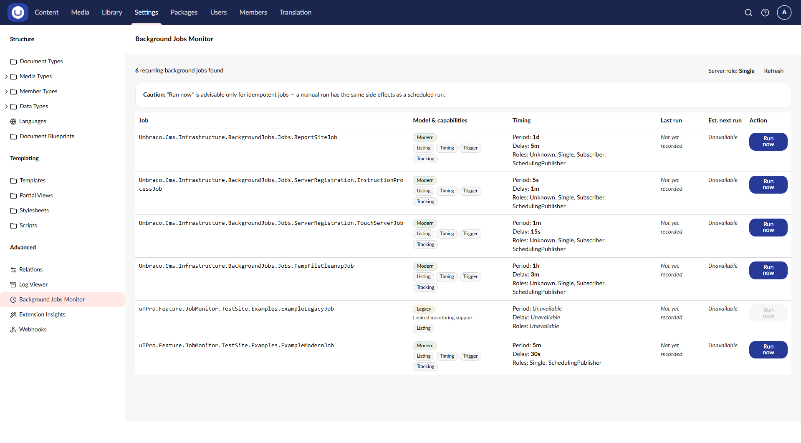

# Getting Started

[← Back to README](../README.md)

## Install via NuGet

```bash
dotnet add package uTPro.Feature.JobMonitor
```

Or add a project reference:

```xml
<ProjectReference Include="path/to/uTPro.Feature.JobMonitor.csproj" />
```

No configuration is required. On the next start, the package registers its dashboard and discovers
your recurring background jobs automatically.

## Framework / Umbraco compatibility

| Umbraco | .NET | Package target |
|---|---|---|
| 16 | .NET 9 | `net9.0` |
| 17 & 18 | .NET 10 | `net10.0` |

The package multi-targets both, so the correct dependencies restore automatically.

## Where it lives in the backoffice

After install, open **Settings** → **Background Jobs Monitor** (under Advanced settings). The
dashboard requires access to the **Settings** section; grant it to a user group under
**Users → User groups → _group_ → Sections** if needed.

## Reading the dashboard

The table lists one row per discovered recurring job:



| Column | Meaning |
|---|---|
| **Job** | The job's full type name. |
| **Model & capabilities** | `Modern` (full support) or `Legacy` (limited); badges show which capabilities apply (Listing, Timing, Trigger, Tracking). |
| **Timing** | Period, delay and server roles. Any value that cannot be read shows as *Unavailable*. |
| **Last run** | Start time (with your timezone), duration and outcome — or *Not yet recorded*. |
| **Est. next run** | Most recent run start + period, labelled as an estimate, or *Unavailable*. |
| **Action** | **Run now** for modern jobs; disabled for legacy/non-invocable jobs. |

Above the table you'll see the **current node's server role** and contextual notices (for example,
that scheduled jobs do not run on this node, or that in-memory history resets on restart).

## Modern vs legacy jobs

- **Modern** — implements `Umbraco.Cms.Infrastructure.BackgroundJobs.IRecurringBackgroundJob`.
  Full monitoring: timing, telemetry and **Run now**.
- **Legacy** — derives from `RecurringHostedServiceBase`. Listed with a *limited support* marker:
  timing is read via reflection where possible and there is no **Run now**.

No per-job wiring is needed — write jobs the standard Umbraco way and they appear after a restart.

## Next steps

- [Configuration](configuration.md)
- [Telemetry & Storage](telemetry-and-storage.md)
- [Manual Trigger (Run now)](manual-trigger.md)
