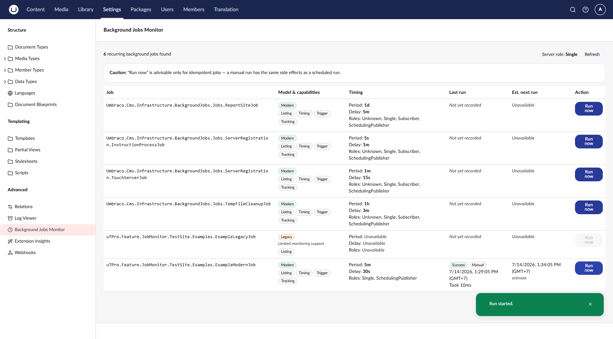

# Manual Trigger (Run now)

[← Back to README](../README.md)

The single deliberate write in Background Jobs Monitor is the **Run now** action. Everything else is
read-only.

## How it works

1. You click **Run now** on a modern job.
2. The API (`POST jobs/{key}/run`) validates authorization (Settings section) and the node's server role.
3. The service acquires a **non-blocking per-job lock**. If the job is already running, it declines.
4. It records the run as **Manual** (with your user id) and starts `RunJobAsync()` on a **background
   thread**.
5. The API returns immediately — `202 Accepted` — without waiting for the job to finish.
6. When the job completes (or throws), the outcome and duration are recorded and the lock is released.

## Responses

| Result | HTTP | Meaning |
|---|---|---|
| Started | `202` | The run began on a background thread. |
| Already running | `409` | A run of this job is already in progress; no second run starts. |
| Role not permitted | `409` | This node's server role does not run this job. |
| Not found | `404` | No triggerable job matched the key. |

## Guards

- **Overlap protection** — a per-job gate ensures at most one manual run of a given job is in
  flight at a time.
- **Server role** — a node that does not run recurring jobs (Subscriber / Unknown), or a job whose
  declared `ServerRoles` exclude the current role, is refused with *role-not-permitted*.
- **Modern only** — legacy `RecurringHostedServiceBase` jobs cannot be invoked directly, so their
  **Run now** control is disabled.

## Idempotency caution

A manual run has the **same side effects** as a scheduled run. The dashboard shows a caution that
**Run now** is advisable only for **idempotent** jobs (jobs that are safe to run again). Triggering a
non-idempotent job on demand can duplicate work or side effects — use with care.

## Accountability

Every manual run records the **initiating backoffice user id**, so durable history shows who ran
what and when.
